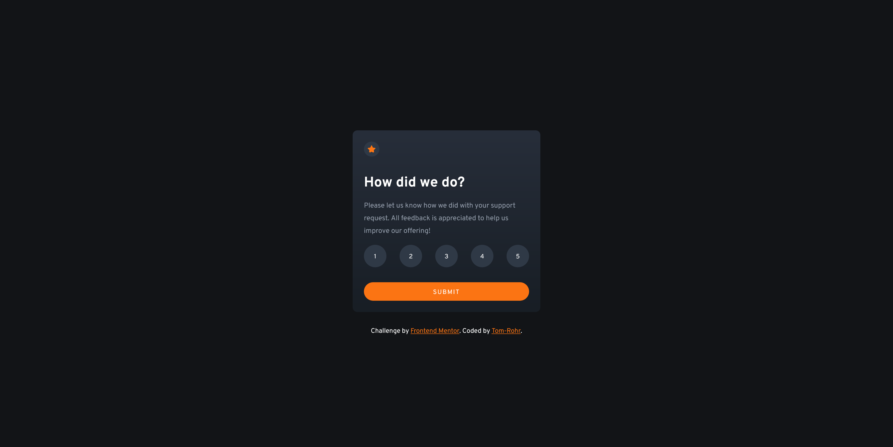
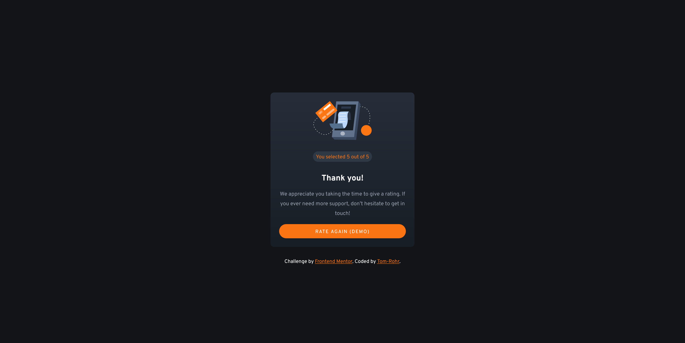

# Frontend Mentor - Interactive rating component solution

This is a solution to the [Interactive rating component challenge on Frontend Mentor](https://www.frontendmentor.io/challenges/interactive-rating-component-koxpeBUmI). Frontend Mentor challenges help you improve your coding skills by building realistic projects.

## Table of contents

- [Overview](#overview)
  - [The challenge](#the-challenge)
  - [Screenshot](#screenshot)
  - [Links](#links)
- [My process](#my-process)
  - [Built with](#built-with)
  - [What I learned](#what-i-learned)
  - [Continued development](#continued-development)
  - [Useful resources](#useful-resources)
- [Author](#author)
- [Acknowledgments](#acknowledgments)

**Note: Delete this note and update the table of contents based on what sections you keep.**

## Overview

### The challenge

Users should be able to:

- View the optimal layout for the app depending on their device's screen size
- See hover states for all interactive elements on the page
- Select and submit a number rating
- See the "Thank you" card state after submitting a rating

### Screenshots




### Links

- Solution URL: [GitHub repo](https://github.com/Tom-Rohr/Frontend-Mentor/tree/main/Newbie_interactive-rating-component)
- Live Site URL: [Netlify](https://fem-interactive-rating-comp.netlify.app/)

### Built with

- Blood
- Sweat
- Tears
- YouTube

## What I learned

### HTML

- List groups(ul) and list items (li).

### CSS

- Style multiple containers in one block.
- Explicitly declare a property to inherit from the parent element.
- The specificity hierarchy relationship between \*, root:, html, and containers.
- Reset position elements to clear default stylings
- Remove default style (bulletdddd points) from list (ul/ol)
- Use flex, align-items, justify-content to center.
- Set min-height:100vh to center on y-axis.
- Create buttons that change colors when hovered over or clicked.
- Hiding items using 'display: none'

### Javascript

- Declaring variables with document.querySelector(), document.querySelectorAll() and document.getElementById() to assign logic to html and css elements.
- Using EventListeners to execute logic and set values based on user interaction. Specifically button clicks.
- Set an EventListener to multiple buttons
- Toggling show/hide of html/css elements by adding or removing a class on an element or changing the value of a class. (display: none / display: block)

### HTML

```html
<ul>
  <li><button class="btn">1</button></li>
  <li><button class="btn">2</button></li>
  <li><button class="btn">3</button></li>
  <li><button class="btn">4</button></li>
  <li><button class="btn">5</button></li>
</ul>
```

### CSS

Style 2 different containers in one body.

```css
.main-container,
.thank-you {
  background-color: var(--medium-grey);
  padding: 1.5rem;
  border-radius: 0.625rem;
}
```

Inherit from parent container

```css
button {
  font-family: inherit;
}
```

Specificity hierarchy

```css
* {
  background: green;
}
:root {
  background: yellow;
}
html {
  background: black;
}
h1 {
  background: blue;
}
```

Reset positioning elements

```css
* {
  margin: 0;
  padding: 0;
  box-sizing: border-box;
}
```

Remove default bullets from list

```css
ul {
  list-style-type: none;
}
```

Use flex, align-items, justify-content to center. min-height:100vh to center on y-axis.

```css
body {
  font-family: "Overpass", sans-serif;
  font-size: 15px;
  background-color: var(--very-dark-blue);
  margin: 1.25rem;
  display: flex;
  flex-direction: column;
  align-items: center;
  justify-content: center;
  min-height: 100vh;
}
```

Buttons that change different colors when focused(last clicked in container) and hovered over.

```css
.main-container ul li button {
  width: 3rem;
  height: 3rem;
  border: none;
  background-color: hsl(214, 20%, 23%);
  color: white;
  padding-top: 0.2rem;
  border-radius: 50%;
  cursor: pointer;
  transition: 0.3s;
}
.main-container ul li button:hover {
  background-color: var(--orange);
}
.main-container ul li button:focus {
  background-color: var(--light-grey);
}

.btn-submit {
  background-color: var(--orange);
  color: white;
  width: 100%;
  padding: 0.8rem 0 0.6rem;
  border: none;
  border-radius: 30px;
  text-transform: uppercase;
  letter-spacing: 0.1rem;
  cursor: pointer;
  transition: 0.3s;
}
.btn-submit:hover {
  background-color: white;
  color: var(--orange);
}
```

Syntax is margin: top left/right bottom. Here 'auto' is centering the image on the x axis in its container.

```css
.thank-you img {
  display: block;
  margin: 0 auto 2rem;
}
```

Class to toggle when switching between the rating and thank-you 'pages'

```css
.hidden {
  display: none;
}
```

### Javascript

Declaring variables representing the rating and thank-you 'pages'.
Note the '.' before the class names; this is the syntax for querySelector().

```js
const mainContainer = document.querySelector(".main-container");
const thanksContainer = document.querySelector(".thank-you");
```

Declaring variables representing the different buttons. Parameters and the Id property set in the html.

```js
const submitButton = document.getElementById("submit");
const rateAgain = document.getElementById("rate-again");
const rating = document.getElementById("rating");
```

Declare a local variable representing all buttons of the .btn class (1-5 buttons)

```js
const rates = document.querySelectorAll(".btn");
```

Defining event listener (click) event for 'submit' button and 'rate again' button. Toggles style.display between 'none' and 'block' to show/hide the rating 'page' and adds/removes the "hidden class" from the thank you 'page' to show/hide.

```js
submitButton.addEventListener("click", () => {
  thanksContainer.classList.remove("hidden");
  mainContainer.style.display = "none";
});

rateAgain.addEventListener("click", () => {
  thanksContainer.classList.add("hidden");
  mainContainer.style.display = "block";
});
```

Sets the local const in the JS file to the value of the most recently clicked rating button (1-5). Test event listener with console.log to ensure respective button values are captured.

```js
rates.forEach((rate) => {
  rate.addEventListener("click", () => {
    rating.innerHTML = rate.innerHTML;
  });
});
```

- Website - [Tom Rohr](https://www.your-site.com)
- Frontend Mentor - [@yourusername](https://www.frontendmentor.io/profile/yourusername)
- Twitter - [@yourusername](https://www.twitter.com/yourusername)
